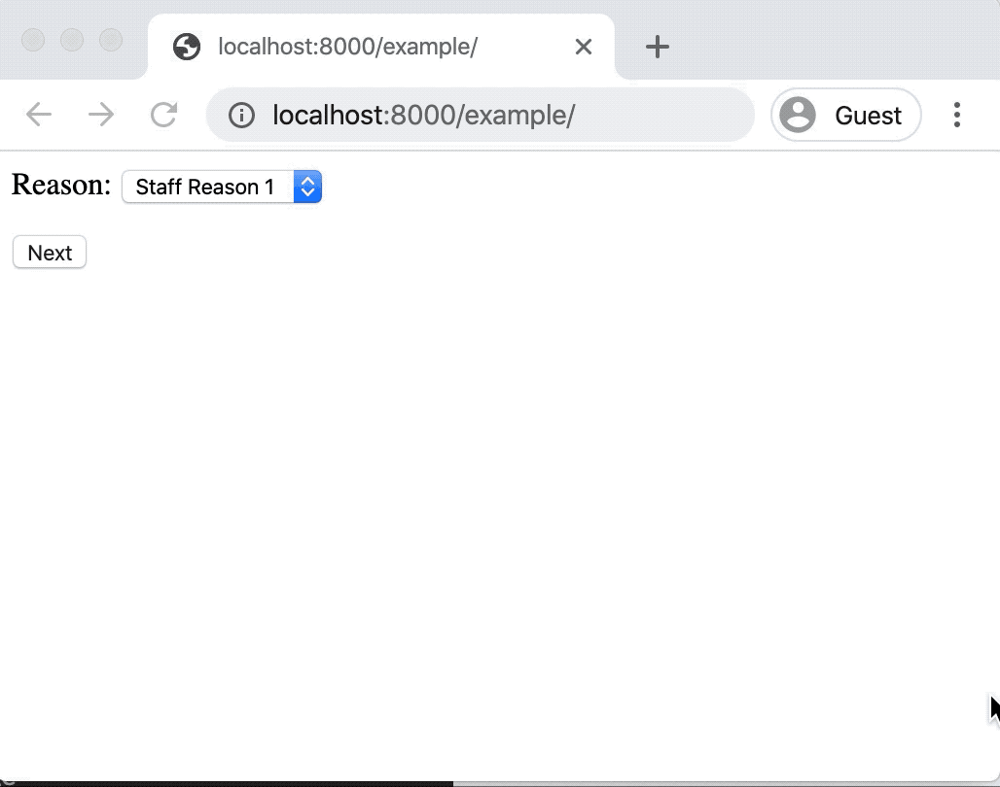

.. _tutorial:

Tutorial
========

``django-args`` builds on the foundational elements of ``python-args``
and allows engineers to construct forms and views directly on top of
functions.

In contrast with Django forms, which provide several mechanisms to
clean fields and validate input, ``django-args`` promotes the philosophy
of keeping validation logic closer to the core code, which is
where ``python-args`` comes into play.

By decorating a function with ``python-args`` ``@arg.validators(...)``,
a Django form can be seamlessly adapted to a ``python-args`` function,
ensuring that you never repeat validation logic for a function and
form fields that collect function arguments.

We will first dive into how this works with the `djarg.views.FormView`
class and construct a view from a ``python-args`` function.

Creating a FormView
-------------------

This example assumes the user has knowledge of ``python-args`` constructs.
If not, please read the
`python-args docs <https://github.com/jyveapp/python-args>`__ first.

Adapting a ``python-args`` function to a form
~~~~~~~~~~~~~~~~~~~~~~~~~~~~~~~~~~~~~~~~~~~~~

We start by creating a function that will modify the ``is_staff``
flag of a Django user in the database. The function takes the user
being modified, the person granting access (or revoking), and the value
of the ``is_staff`` flag.

We validate the arguments using ``@arg.validators()``:

.. code-block:: python

  import arg

  def ensure_granter_is_staff(granter):
      if not granter.is_staff:
          raise ValueError('Granter must be staff to grant staff access.')

  @arg.validators(ensure_granter_is_staff)
  def grant_staff_access(user, granter, is_staff):
      user.is_staff = is_staff
      user.save()

This function has a single validator that ensures the granter has sufficient
privileges to grant staff access.

When functions are decorated with ``@args.validators()``, those validators
can be directly adapted to a Django form that collects the arguments.
For example, before we write the form view for this function, let's write
the form:

.. code-block:: python

  from django import forms

  class GrantStaffAccessForm(forms.Form):
      user = forms.ModelChoiceField(queryset=User.objects.all())
      granter = forms.ModelChoiceField(queryset=User.objects.all())
      is_staff = forms.BooleanField()

Although we would likely determine the user performing the request from
some other means, this form purely serves as an example. Given this form
that collects the input needed for our ``grant_staff_access`` function,
we can call `djarg.forms.adapt` to adapt the ``GrantStaffAccess``
form to the ``grant_staff_access`` function:

.. code-block:: python

    import djarg.forms

    form_instance = djarg.forms.adapt(GrantStaffAccess(), grant_staff_access)

Instead of having to specify validators for form fields or performing a custom
form ``clean()`` method, all of the validators on the function are automatically
used when relevant. For example, any validators that only take the form
field as an argument are used as validators on the individual field, while
validators that take multiple arguments are used in the form ``clean()`` method.

When building forms on top of complex functions with many layers of validation,
this can not only help reduce the complexity of frontend code, but it also
offers the ability to more easily test validation and keep the core validation
code closer to the business logic.

Automatically adapting forms with ``djarg.views.FormView``
~~~~~~~~~~~~~~~~~~~~~~~~~~~~~~~~~~~~~~~~~~~~~~~~~~~~~~~~~~

Users will typically not be using `djarg.forms.adapt` directly like shown
and will instead be using `djarg.views.FormView`. For example:

.. code-block:: python

    import djarg.views

    class GrantAccessView(djarg.views.FormView):
        form_class = GrantStaffAccessForm
        func = grant_staff_access

The `djarg.views.FormView` automatically adapts the form class to the
provided ``python-args`` function ``func``. When forms are successfully
validated, ``func`` is called in the form view's ``form_valid``
method. And *voila*, you have a Django Form View directly built on top
of a function with much less boilerplate.

``django-args`` tries to abide by the principle of keeping as much
validation logic as possible out of the view and form layer, a complexity
that can compound when working with sophisticated input and validation
scenarios.

So, what if we instead want to provide the currently authenticated user
as the ``granter`` argument to our ``grant_staff_access`` function? It
is far more common to use the currently-authenticated user as the person
performing actions in a view.

The `djarg.views.FormView` class does not require that all ``func``
arguments come from the form. Others can also dynamically come from
the ``get_default_args()`` method. For example, assuming we are using
Django's authentication middleware, we can update our form and view like so:

.. code-block:: python

  from django import forms

  import djarg.views

  class GrantStaffAccessForm(forms.Form):
      user = forms.ModelChoiceField(queryset=User.objects.all())
      is_staff = forms.BooleanField()

  class GrantAccessView(djarg.views.FormView):
      form_class = GrantStaffAccessForm
      func = grant_staff_access

      def get_default_args(self):
          return {
              **super().get_default_args(),
              'granter': self.request.user
          }

In the above, the ``user`` and ``is_staff`` fields will be selected by
the user. The ``granter`` argument is provided from the ``get_default_args``
method.

.. note::

  The ``request`` variable is always included in the default args and
  accessible to the wrapped function in the view. The example
  from above could have also used
  ``@arg.defaults(granter=arg.val('request').user)(grant_staff_access)``
  as the ``func`` attribute to accomplish the same thing.

The `djarg.views.FormView` is just like any other
``django.views.generic.edit.FormView``. You have access to the ``form``
variable in the template. For example, we can render our form with
the following template:

.. code-block:: jinja

  <form action=".?{{ request.GET.urlencode }}" method="post" enctype="multipart/form-data">
    

    {{ form.as_p }}

    <button type="submit">
      Submit
    </button>
  </form>

Assuming that we've linked a URL to our view, the form view behaves like
so:

In the above, the ``ensure_granter_is_staff`` validator is failing
because the authenticated user is not a staff member. When this validator
fails, it appears as a failure of the form's ``clean()`` method and rendered
by Django.

When all validation passes, the view runs ``func``. In
this example, the form redirects back to an empty slate on success:

Lazy form fields using ``python-args`` utilities
------------------------------------------------

When `djarg.views.FormView` adapts the form, it also ensures that
the form is compatible with various lazy execution utilities in ``python-args``.

A common pattern in Django forms is to dynamically
modify field attributes based on data passed from the view.
For example, let's continue our example of granting staff access and
dynamically render choices based on the permission level of the granter.

.. code-block:: python

  class GrantStaffForm(forms.Form):
      reason = forms.ChoiceField(choices=[('', '---')])
      user = forms.ModelChoiceField(queryset=User.objects.all())
      is_staff = forms.BooleanField()

      def __init__(self, **kwargs):
          # Assume the user has overridden the view's ``get_form_kwargs``
          # method and passed in the user
          granter = kwargs.pop('granter')

          super().__init__(**kwargs)

          if granter.is_staff:
              self.fields['reason'].choices = [
                  ('reason_type1', 'Reason type 1'),
                  ('reason_type2', 'Reason type 2')
              ]
          elif granter.is_superuser:
              self.fields['reason'].choices = [
                  ('reason_type1', 'Reason type 1'),
                  ('reason_type2', 'Reason type 2')
              ]

Basic user experience tweaks like these can make dynamic form processing
code more difficult to follow and unwind. Not to mention the additional
boilerplate needed in order to pass the ``granter`` as a keyword argument
to the instantiation of the form.

``django-args`` integrates with ``python-args`` ``arg.init`` utility
that allows lazily loading a class. Use ``djarg.forms.Field`` to wrap
a field so that field properties can be lazily evaluated.

In this example, we are still using our earlier ``GrantStaffView``
example. When ``get_default_args`` is implemented, all of these arguments
are available to use when using `djarg.forms.Field` and associated
``python-args`` utilities. For example, here's our updated form:

.. code-block:: python

  def get_grant_reasons(granter):
      if granter.is_staff:
          return [
              ('staff_reason_1', 'Staff Reason 1'),
              ('staff_reason_2', 'Staff Reason 2')
          ]
      elif granter.is_superuser:
          return [
              ('superuser_reason_1', 'Superuser Reason 1'),
              ('superuser_reason_2', 'Superuser Reason 2')
          ]
      else:
          return [('', '---')]

  class GrantStaffForm(forms.Form):
      reason = djarg.forms.Field(
          forms.ChoiceField,
          choices=arg.func(get_grant_reasons)
      )
      user = forms.ModelChoiceField(queryset=User.objects.all())
      is_staff = forms.BooleanField()

In the above, we have used `djarg.forms.Field` to lazily instantiate
a Django form field of class ``forms.ChoiceField``. When instantiating
the field, we lazily execute the ``get_grant_reasons`` function to
fill in choices. Since the ``granter`` argument is available to our
form as a default argument, it can be used in ``python-args`` lazy
utilities (for a refresher on these, check out the
`python-args docs <https://github.com/jyveapp/python-args>`__).

With this slight change, we have less boilerplate in our forms. We
can extend this concept to dynamically creating querysets for model choice
fields, dynamic initial values, dynamic widgets, and any other attributes
required by Django form fields.

In this example, any form field has access to the default arguments
provided by the view. In the next section of this tutorial, we expand on
these concepts with the introduction of `djarg.views.WizardView`, which
along with default arguments, allows form steps and conditions to
be dynamically determined from previously entered steps.

Creating a WizardView
---------------------

``django-args`` comes with an integration with
`django-formtools <https://django-formtools.readthedocs.io/en/latest/>`__.
``django-formtools`` has several wizard objects. ``django-args``
provides the base `djarg.views.WizardView` object and the
`djarg.views.SessionWizardView` that uses a session storage backend to
track steps.

For those unfamiliar with ``django-formtools``, the wizard object
allows a user to provide a series of forms that are collected over
subsequent steps. Users can also define conditions so that steps
can be conditionally included or ignored. Consult the
`django-formtools docs <https://django-formtools.readthedocs.io/en/latest/>`__
for more information.

Similar to how dynamic form field instantiation can lead to a lot of boilerplate,
dynamically instantiating form fields and conditionally showing steps
in form wizards can also incur a significant amount of boilerplate.
``django-args`` aims to not only allow form wizards to be seamlessly
built on top of ``python-args`` functions, but to also minimize the associated
boilerplate for various user experience patterns.

Collecting input over multiple steps
~~~~~~~~~~~~~~~~~~~~~~~~~~~~~~~~~~~~

For example, let's use our grant staff function and collect information
over multiple steps. We are going to make a modification to our function
and also take in the reason and an explanation:

.. code-block:: python

  def ensure_granter_is_staff(granter):
      if not granter.is_staff:
          raise ValueError('Granter must be staff to grant staff access.')

  # Make sure we have clean text input that is stripped
  @arg.defaults(
      reason=arg.val('reason').strip(),
      explanation=arg.val('explanation').strip()
  )
  # Make sure the granter is the right tier
  @arg.validators(ensure_granter_is_staff)
  def grant_staff_access(user, granter, is_staff, reason, explanation):
      user.is_staff = is_staff
      user.save()

      # Log the reason and explanation associated with the change
      GrantRecord.objects.create(
          granter=granter,
          user=user,
          is_staff=is_staff,
          reason=reason,
          explanation=explanation
      )

In this example, we extend our function to log a record of grants
with reasons and explanations. We also use ``@arg.defaults`` to clean
our input. Although the form will clean up some of the input for us,
this extra layer of protection ensures other functions calling ours
will have clean input.

Now let's make a form wizard that leads people through
collecting information step-by-step. We do this by splitting our input
into separate forms:

.. code-block:: python

  class GrantStaffReasonForm(forms.Form):
      reason = djarg.forms.Field(
          forms.ChoiceField,
          choices=arg.func(get_grant_reasons)
      )

  class GrantStaffExplanationForm(forms.Form):
      explanation = forms.CharField()

  class GrantStaffUserForm(forms.Form):
      user = forms.ModelChoiceField(queryset=User.objects.all())
      is_staff = forms.BooleanField()

In the above, we collect the information needed for our wizard over
three steps. The form wizard object looks like the following:

.. code-block:: python

  from django import shortcuts

  import djarg.views

  class GrantStaffWizard(djarg.views.SessionWizardView):
      func = grant_staff_access
      form_list = [
          GrantStaffReasonForm,
          GrantStaffExplanationForm,
          GrantStaffUserForm,
      ]

      def get_default_args(self):
          return {'granter': self.request.user}

      def done(self, *args, **kwargs):
          self.run_func()
          return shortcuts.redirect('.')

Similar to our `djarg.views.FormView` example, we use the authenticated
user as the default argument for ``granter``. Since ``django-formtools``
requires us to implement a ``done()`` method, we call ``run_func()``
to run the function with the cleaned form wizard data and redirect back
to the starting of the wizard.

`djarg.views.SessionWizardView` extends the session wizard from
``django-formtools``, so we can create a wizard template that behaves
similarly:

.. code-block:: jinja

  {{ form.media }}

  <form action=".?{{ request.GET.urlencode }}" method="post" enctype="multipart/form-data">
    
    {{ wizard.management_form }}
    {{ form.as_p }}

    
        <button type="submit">Next</button>
    
      <button type="submit">
        Submit
      </button>
    
  </form>

When saving this template and updating the ``template_name`` attribute on
our wizard view, we can then go through the view after linking it in our
urls file. It looks like the following:

As shown above, our first step dynamically determines the reasons.
Since the user in this example is not a superuser, the staff reasons
are shown. Once the user has performed the flow, the function runs
and they are redirected back to the beginning.

Form wizards are not all that different in how they perform validation
in comparison to the standard form view. For example, if we attach a
validator to the explanation to ensure that it's a minimum length, this
validator will only execute on the second step. For example:

.. code-block:: python

  def explanation_must_be_long(explanation):
      if len(explanation) < 10:
          raise ValueError('The explanation must be 10 or more characters')

  @arg.defaults(...)
  @arg.validators(ensure_granter_is_staff, explanation_must_be_long)
  def grant_staff_access(user, granter, is_staff, reason, explanation):
      ...

Adding this validator produces a flow like the following:

Conditional step collection
~~~~~~~~~~~~~~~~~~~~~~~~~~~

``django-args`` integrates seamlessly with conditional step execution
in ``django-formtools``. Similar to how `djarg.forms.Field` allows
for lazy loading of form fields based on default arguments and previous
steps, conditions can also utilize default arguments and any previous
steps that were successfully submitted.

For example, let's update our ``grant_staff_access`` to optionally
allow an explanation and remove minimum length requirements.
Let's also update our form wizard to only show the explanation step
if the first reason is chosen:

.. code-block:: python

  def should_show_explanation_step(reason):
      """Only collect an explanation when the reason is the first reason"""
      return reason in ('staff_reason_1', 'superuser_reason_1')

  @arg.defaults(...)
  @arg.validators(ensure_granter_is_staff)
  def grant_staff_access(user, granter, is_staff, reason, explanation=''):
      ...

  class GrantStaffWizard(djarg.views.SessionWizardView):
      func = grant_staff_access
      form_list = [
          GrantStaffReasonForm,
          GrantStaffExplanationForm,
          GrantStaffUserForm,
      ]
      condition_dict = {
         '1': arg.func(should_show_explanation_step)
      }

      ...

In the above, we utilize ``django-formtools`` ``condition_dict``
attribute, which allows us to specify functions that determine if steps
should be shown. Although ``django-formtools`` allows you to label your steps,
not labeling them results in the first step being labeled ``"0"``, the
second step ``"1"`` and so on. In our case, we have instructed that the second
step only be shown if we pick the first ``reason``.

Since `djarg.views.SessionWizardView` makes all of the submitted arguments
available to ``python-args`` functions, we can create conditions that will
use previously-submitted steps. In our case, that step is the ``reason``
field that was collected.

Here's what it looks like if we choose the first reason in the first step
and the second reason in the first step. The former prompts the user
for an explanation while the latter does not:

Using single and multiple object views
--------------------------------------

The base form and wizard views from ``django-args`` have child subclasses
that make it easier for updating individual and multiple objects.
This follows from a similar philosophy of Django's generic update
views (``UpdateView``, ``CreateView``, etc).

Each main view has an associated ``Object`` view for editing a single object
and ``Objects`` view for editing multiple objects.

Using ``ObjectFormView`` and ``ObjectWizardView``
~~~~~~~~~~~~~~~~~~~~~~~~~~~~~~~~~~~~~~~~~~~~~~~~~

The `djarg.views.ObjectFormView` is functionally the same as
`djarg.views.FormView`, and this is also true for `djarg.views.ObjectsWizardView`.
Similar to
`Django's Generic Editing Views <https://docs.djangoproject.com/en/3.0/ref/class-based-views/generic-editing/>`__,
any URL constructed from a single object view has an associated primary key
field in the URL (i.e. ``/url-path/<int:pk>/``). Along with that, views
must provide a ``model`` or ``queryset`` attribute so that Django knows how to
fetch the object.

When views are constructed, the ``object`` variable is a default argument
for ``func`` and is available in the view like other Django edit views.
It is up to the user constructing the ``python-args`` ``func`` attribute
to map the ``object`` argument to the associated object of their function.

All of these properties apply to both `djarg.views.ObjectFormView`
and `djarg.views.ObjectWizardView` classes.

Using the ``ObjectsFormView`` and ``ObjectsWizardView``
~~~~~~~~~~~~~~~~~~~~~~~~~~~~~~~~~~~~~~~~~~~~~~~~~~~~~~~

The `djarg.views.ObjectsFormView` and `djarg.views.ObjectsWizardView`
are identical to their individual object counterparts with the following
differences:

1. Instead of an ``object`` default argument, there is an ``objects``
   default argument and view variable with all of the objects.
2. Instead of taking a primary key argument from the URL, the primary keys
   of all objects are determined from the URL query string. For example,
   ``/url-path/?pk=1&pk=2`` will operate over two objects. If PKs aren't
   provided or if any PKs don't exist, a 404 is raised.

Similar to the single object views, the ``func`` attribute must map the
``objects`` variable to the proper argument in the function. One can
also use ``arg.parametrize`` to parametrize a list of objects to
single-object functions.

Other ``django-args`` view settings
-----------------------------------

By default, django ``FormView`` and form-tools ``WizardView`` classes
do not display form errors when errors happen after form or
wizard validation. ``django-args`` defaults to rendering these errors
as normal form errors. In the case of wizards, runtime errors are
rendered on the last step.

This behavior can be suppressed by setting the ``raise_run_errors`` attribute
to ``True`` in the view or wizard definition.

Other ``django-args`` utilities
-------------------------------

Using ``djarg.qset``
~~~~~~~~~~~~~~~~~~~~

``python-args`` comes with several utilities for lazily-evaluating call
arguments. ``django-args`` also comes with a `djarg.qset` utility for
coercing argument defaults into querysets.

For example, say that you want to ensure your function is always called
with a queryset that has properly cached all necessary relations:

.. code-block:: python

    @arg.defaults(
      users=djarg.qset('users', model=User).prefetch_related('groups')
    )
    def get_user_groups(users):
        """Return all of the groups of the users"""
        return {
            group
            for user in users
            for group in user.groups.all()
        }

When using `djarg.qset`, the argument (in this case ``users``) will be
coerced into a queryset. Similar to other ``python-arg`` lazy utilities,
the queryset value can be lazily chained to be evaluated.

Since our function always prefetches groups, one does not have to worry
about the caller prefetching the proper relations for the function.

The `djarg.qset` utility automatically coerces the other values:

1. ``None``, which will return an empty queryset.
2. A single model.
3. A list of models.
4. A single PK or list of PKs.

For example, one can also do ``get_user_groups([user_id1, user_id2])`` with
the `djarg.qset` utility.

.. note::

  In addition to providing a ``model`` as the argument to `djarg.qset`, one
  can also provide a ``qset`` keyword argument as a queryset to use
  when constructing the final queryset.

Using ``djarg.views.SuccessMessageMixin``
~~~~~~~~~~~~~~~~~~~~~~~~~~~~~~~~~~~~~~~~~

Similar to
`Django's SuccessMessageMixin <https://docs.djangoproject.com/en/3.0/ref/contrib/messages/#django.contrib.messages.views.SuccessMessageMixin>`__,
the `djarg.views.SuccessMessageMixin` allows users to define a
``success_message`` attribute that is rendered on successful completion of any
``django-args`` views. The success message is automatically formatted with
the arguments passed into the ``func`` of the view. One can also override
``get_success_message`` to dynamically construct success messages based on
the arguments and results of the ``func``. For example:

.. code-block:: python

  class GrantStaffWizard(djarg.views.SuccessMessageMixin, djarg.views.SessionWizardView):
      func = grant_staff_access
      success_message = 'Successfully granted staff access from {user}.'

Or:

.. code-block:: python

  class GrantStaffWizard(djarg.views.SuccessMessageMixin, djarg.views.SessionWizardView):
      func = grant_staff_access

      def get_success_message(self, args, results):
        return f'Successfully granted staff access from {args["user"]}.'
